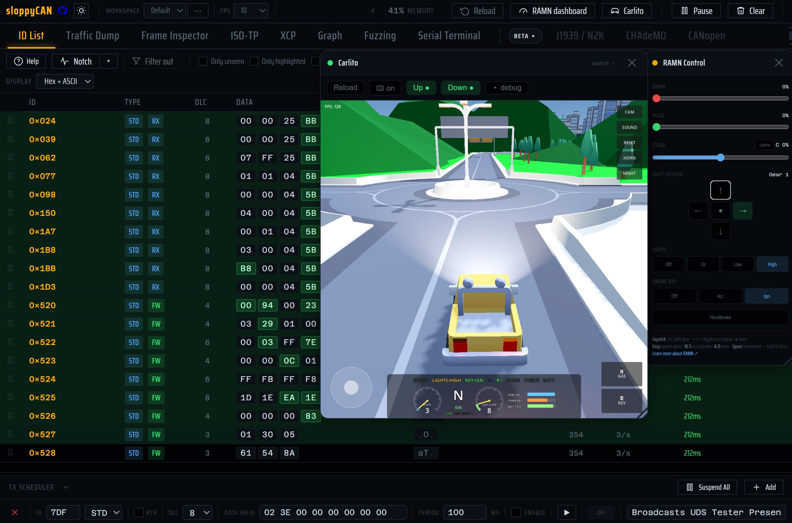

# SloppyCAN

Want to experiment with a CAN bus, but too lazy to install anything? SloppyCAN is here for you.

**[Try it online →](https://leaukojo.github.io/sloppycan/)**



## What it is

A browser-based CAN bus tool. No backend, no install, no build step, just open `index.html` and go.

- The classic CAN tools: live ID tables, traffic logging with CSV export, frame crafting,
  graphing, fuzzing.
- Diagnostics and industrial protocols: UDS, OBD-II, KWP2000, XCP, J1939/NMEA 2000/ISOBUS,
  CANopen, CHAdeMO.
- Drives [RAMN](https://github.com/ToyotaInfoTech/RAMN) and
  [Carlito](https://github.com/leaukojo/carlito) for a full sandbox: drive a car in a virtual
  world while a real, physical CAN bus carries the traffic.
- A 100% virtual **Demo** mode if you don't have hardware.
- Interactive explainers for learning CAN itself (arbitration, ISO-TP, bit-stuffing), like the
  [ISO-TP explainer](https://leaukojo.github.io/sloppycan/explainers/isotp-explainer.html).

## Requirements

- **Chrome or Edge** on desktop (Web Serial API for SLCAN; WebUSB for gs_usb).
  Android Chrome works for SLCAN via a WebUSB CDC fallback.
- A supported USB-to-CAN adapter: pick the type with the **Adapter** dropdown
  (`SLCAN` or `gs_usb`, e.g. candleLight / CANable / RAMN). gs_usb is WebUSB-only and classic
  CAN only (no CAN-FD).
- No hardware? Click **Demo** for a fully simulated bus.

## Running

Open `index.html` directly, everything except Carlito works straight from `file://`. To run a
modified version of Carlito, you will need to serve it locally with Python:

```
python -m http.server 8000 --bind 127.0.0.1      # then open http://localhost:8000/index.html
```

Web Serial requires a secure context (`file://`, `localhost`, or HTTPS), so reaching the page
from another device needs HTTPS set up in front of it, not plain `http.server`.

By default, the Carlito tab loads the hosted **stable** build of
[Carlito](https://github.com/leaukojo/carlito) — the promoted one, at
<https://leaukojo.github.io/carlito/stable/>. The **stable | dev** selector in the Carlito window
header switches to the dev channel (<https://leaukojo.github.io/carlito/dev/>, rebuilt on every
push), and the choice sticks via `localStorage`; `?carlitoBuild=dev` does the same from a link.

To point it at your own build instead (e.g. after modifying the game and re-exporting it), serve
the folder holding your build alongside SloppyCAN and open it with a `carlitoUrl` query param:
`http://localhost:8000/sloppycan/index.html?carlitoUrl=../carlito/build/web/index.html`. That
override replaces both channels (the selector hides while it is active) and also sticks via
`localStorage`, so you don't need to repeat it on later visits.

Demo mode simulates more protocols than a single real bus would carry at once, so each
diagnostic module (UDS, OBD-II, KWP2000, …) only generates traffic while its tab is open.

## Features

ID List, Traffic Dump, TX Scheduler, Frame Inspector, Graph, Fuzzing, and protocol tabs for
ISO-TP (UDS/OBD-II/KWP2000), J1939 (NMEA 2000/ISOBUS), CHAdeMO, XCP-on-CAN, and CANopen. Most
tabs are self-contained and work fully in Demo mode (only one base-traffic simulation runs at a
time, reload to switch back to the default RAMN traffic).

Standalone protocol explainers (ISO-TP, OBD-II, UDS, KWP2000, NMEA 2000, ISOBUS, XCP, CANopen,
EV charging, a DTC decoder, and a CAN physical-layer walkthrough) live in
[`explainers/`](explainers/) and open from `file://` with no connection needed. Most are also
linked in-app via "Learn how … works ↗".

## Limitations / known work-in-progress

- Some features are still **beta**: auto-generated and not yet fact-checked against spec or
  real hardware.
- Not everything is cross-linked yet, e.g. OBD-II RPM isn't (yet) the same signal as Carlito's
  RPM when the two are connected.
- The Graph tab needs further performance work on large traces.
- Android support works but isn't polished yet.
- Still needs more real-world user testing. Feedback and issues welcome.

## License

MIT, with one binding restriction: **this software may only be used with CAN bus testbeds,
bench setups, and simulators.** Connecting it to the CAN bus of a real, in-service, or occupied
vehicle, or any system that can affect the safety of people or property, is prohibited by the
license. See [`LICENSE`](LICENSE) for the full text.

## Contributing

The app core is `index.html` + `sloppycan.css` + `sloppycan.js`. Everything else is an optional
bolt-on module (`graph.js`, `fuzz.js`, `j1939.js`, `chademo.js`, `xcp.js`, `canopen.js`,
`ramn.js`, `carlito.js`), wired into the core through a few hooks tagged *"remove to revert"*.
Delete a module and its tagged seams and the feature drops out cleanly.

See [`.claude/core-arch.md`](.claude/core-arch.md) and [`.claude/modules.md`](.claude/modules.md)
for architecture details, and [`CONTRIBUTING.md`](CONTRIBUTING.md) for how to file issues and
submit pull requests.

---

⚠️ SloppyCAN was built with Claude Code under human supervision
for testing and fact-checking, so review it yourself before relying on it. It's for **learning
CAN, not for connecting to real vehicles** (see [License](#license)).
